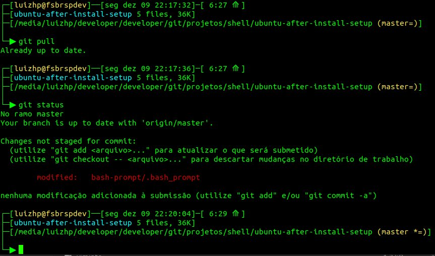

# **My Ubuntu after-install setup Bucket List**
"What I need to do after Ubuntu Linux installation"

## **Installation**
Just clone and you're ready to go

## **How to use**
Review the files before using them, check if apply to you

### **Contents**
> **Core installation**
`./install-workstation.sh`

> **Gnome settings**
`./gnome-settings.sh`

> **Prompt-bash**
`cp -r ./bash-prompt/ ~/`
- modified [bash-prompt](https://gist.github.com/kfcobrien/c75a918682c6c9b11d3aa6dedb5d3928) from [Kevin O'Brien](https://github.com/kfcobrien)


> **Tmux configuration files**
`cp -r ./tmux/ ~/`
- modified [tmux-setup](https://github.com/gpakosz/.tmux) from [Gregory Pakosz](https://github.com/gpakosz)

### **Steps after ubuntu installation**

1. At *Online accounts* signin to *Ubuntu Single Sign-on* and *Google* services

2. At *Software Apps* signin to *Ubuntu Single Sign-on* and *Snap*

3. Run **Core installation**
```
    ./install-workstation.sh
```
4. Run **Gnome settings**
```
    ./gnome-settings.sh
```
5. Reboot
6. Settings

   - *(Dual Monitor)* Select prefered device sound output
   - Set your system avatar
   - Adjust *gnome shell terminal* preferences
   - Mount your *Samba*, *DLNA* and other network resources

7. *Google Chrome*

   a. Authentication and Syncing

   b. Disable *Google Chrome* from background at systemtray

   c. Install *gnome extensions*

      - https://extensions.gnome.org/extension/1036/extensions/
      - https://extensions.gnome.org/extension/1139/apt-update-indicator/

   d. Pin favorite tabs
   
      - https://mail.google.com/
      - https://mail.yahoo.com/
      - https://web.whatsapp.com/
      - https://contacts.google.com/
      - https://calendar.google.com
      - https://drive.google.com/drive/my-drive
      - https://keep.google.com/
      - https://play.google.com/music/listen#/home
      - https://www.youtube.com/

   e. Put *Google Keep Note* app at Apps and Desktop

8. *Google Earth Pro*

   - Setup resolution
   - Import custom KML files

9. Generate SSH keys

   a. ssh-keygen -t rsa -b 4096 -C "customname"

   b. sudo gedit /home/$USER/.ssh/id_rsa.pub
   - Copy and paste at *Github* SSH Keys

10. *Git*

    ```
    git config --global user.name "my-username"

    git config --global user.email "my@email"
    ```
   
11. *Visual Studio Code*

    a. *Settings Sync* from Shan Khan
    - Setup from Github's Gist
    - Download settings

12. *Telegram*

    a. Put *telegram-desktop* to start automatically at *Startup Apps*
    ```
    Name: Telegram-desktop
    Command: telegram-desktop -startintray
    ```

13. *Signal*

    a. Put *signal-desktop* to start automatically at *Startup Apps*
    ```
    Name: Signal-desktop
    Command: signal-desktop --use-tray-icon --start-in-tray
    ```

14. *VLC*
15. *Postman*
16. *Virtualbox*
17. *konversation*
18. *gnucash*
19. *HP Linux Imaging and Printing*

    a. Download [HPLIP Driver](https://developers.hp.com/hp-linux-imaging-and-printing/gethplip)

    b. Install

    c. Disable Annoying *HP System Tray Service* at *Startup Apps*

20. *tor-browser*

    a. Download `https://www.torproject.org/download/`

    b. Extract and copy to proper folder
    ```
    sudo mv tor-browser/ /opt/
    cd /opt/tor-browser
    ./start-tor-browser.desktop
    ```
    c. Copy *start-tor-browser.desktop* file to desktop, adjust paths if necessary

21. *Android-Studio*

    a. Already pre-installed by **Core installation**, need to finish installation

    b. After installing, exit

    c. Return to *click on configure >> plugins* and install *Flutter* and *Dart*

22. *Flutter*

    - Download and Install [Flutter](https://flutter.dev/docs/get-started/install/linux) following instructions

23. *MongoDB Compass*

    - Download and Install [MongoDB Compass](https://www.mongodb.com/download-center/compass) following instructions

24. *Robo 3T*

    - Download and Install [Robo 3T](https://robomongo.org/download) following instructions

25. *Prompt-Bash*
    ```
    cp -r ./bash-prompt/ ~/
    ```

26. *tmux*
    ```
    cp -r ./tmux/ ~/
    ```

## Contributing

Contributions are always welcome! 👊

You can reach me out at Twitter [@luizhp](https://twitter.com/luizhp)
